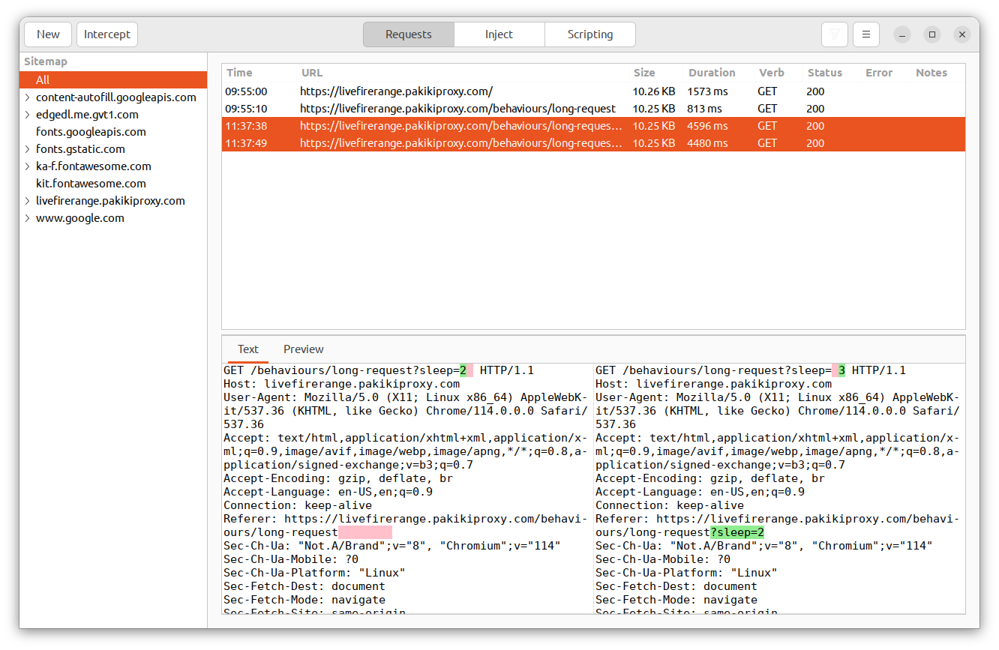
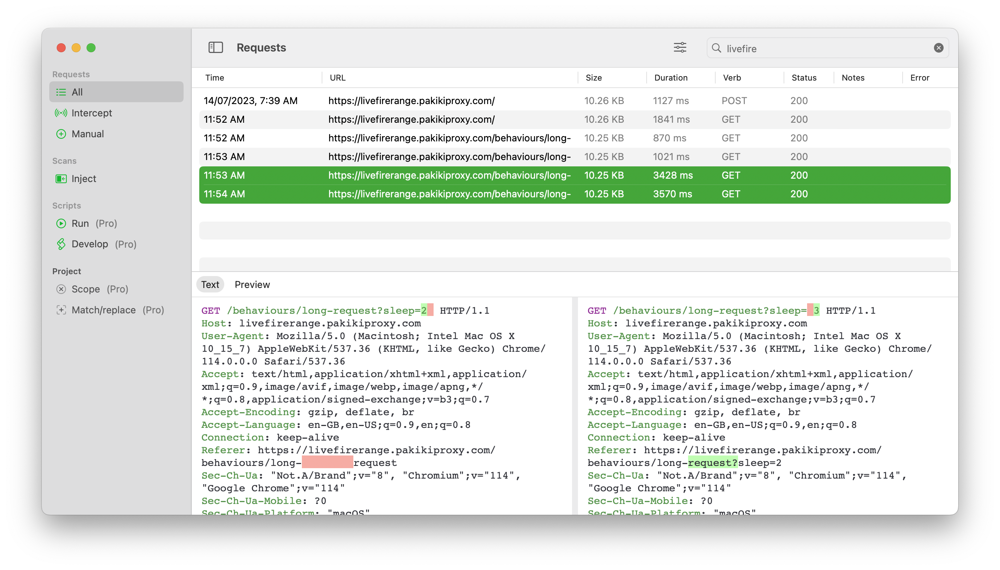

# Comparing

To compare two requests, simply select them both within the requests list. The compared requests will then appear in the request preview pane with the differences highlighted in green/red:

<!-- tabs:start -->

#### **Linux**

<picture>
  <source media="(prefers-color-scheme: dark)" srcset="../_media/Linux/Dark/Compare.png">
  
</picture>

#### **MacOS**

<picture>
  <source media="(prefers-color-scheme: dark)" srcset="../_media/Mac/Dark/Compare.png">
  
</picture>

<!-- tabs:end -->

The preview pane can also be used to see a visual difference between the responses.