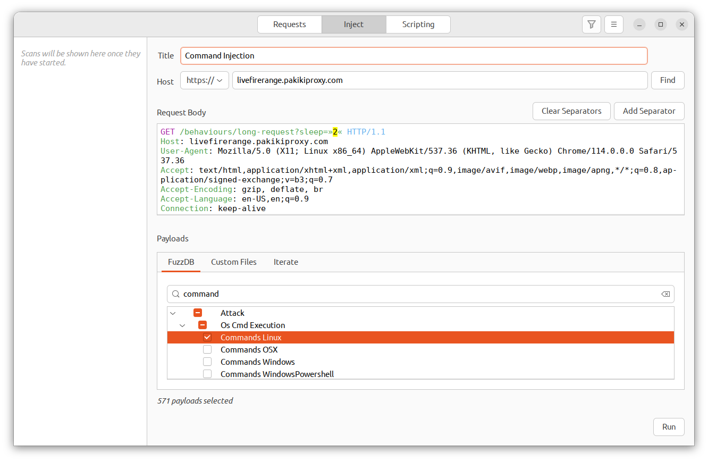
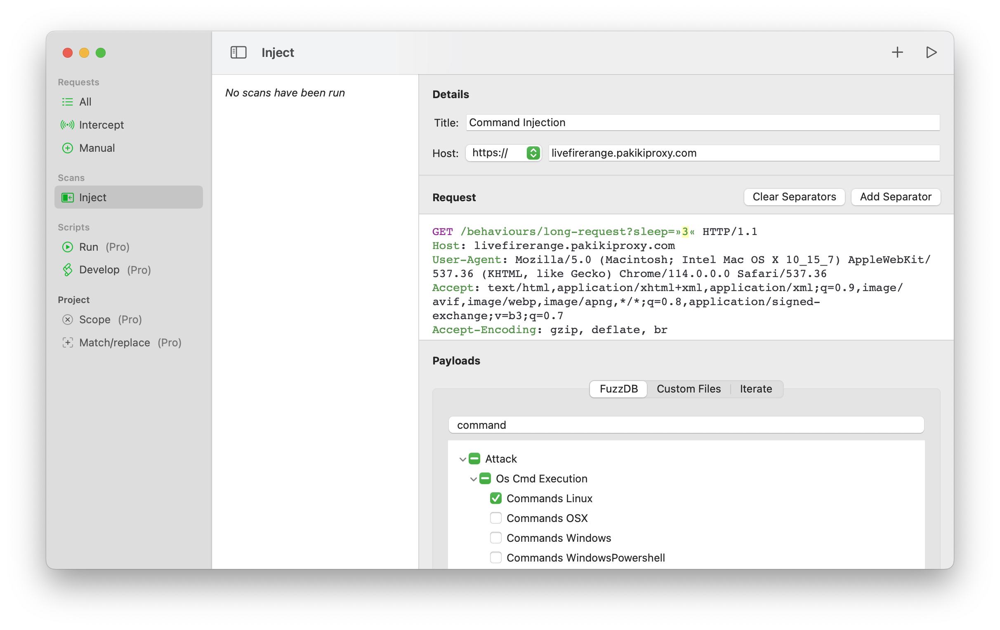
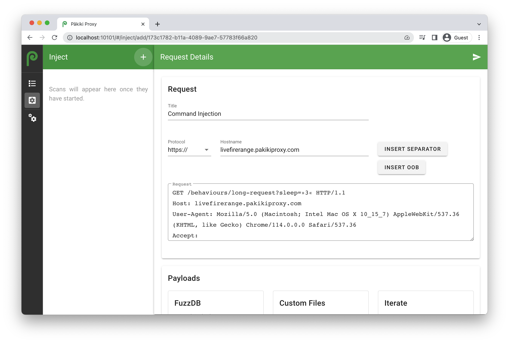
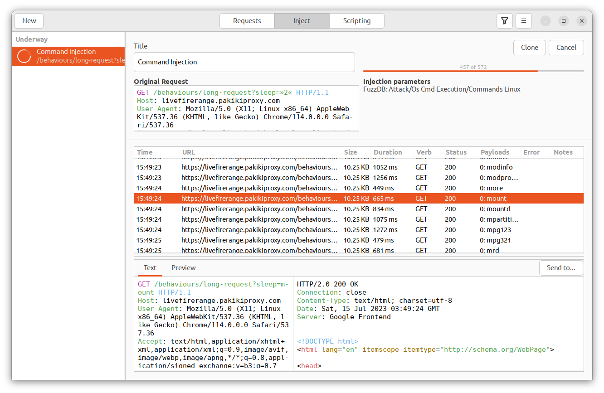
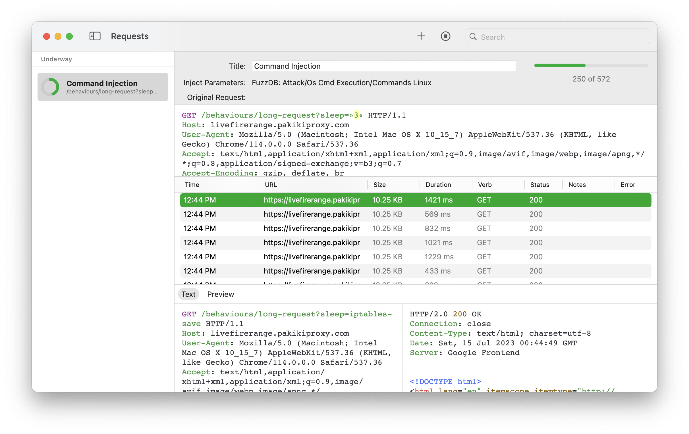
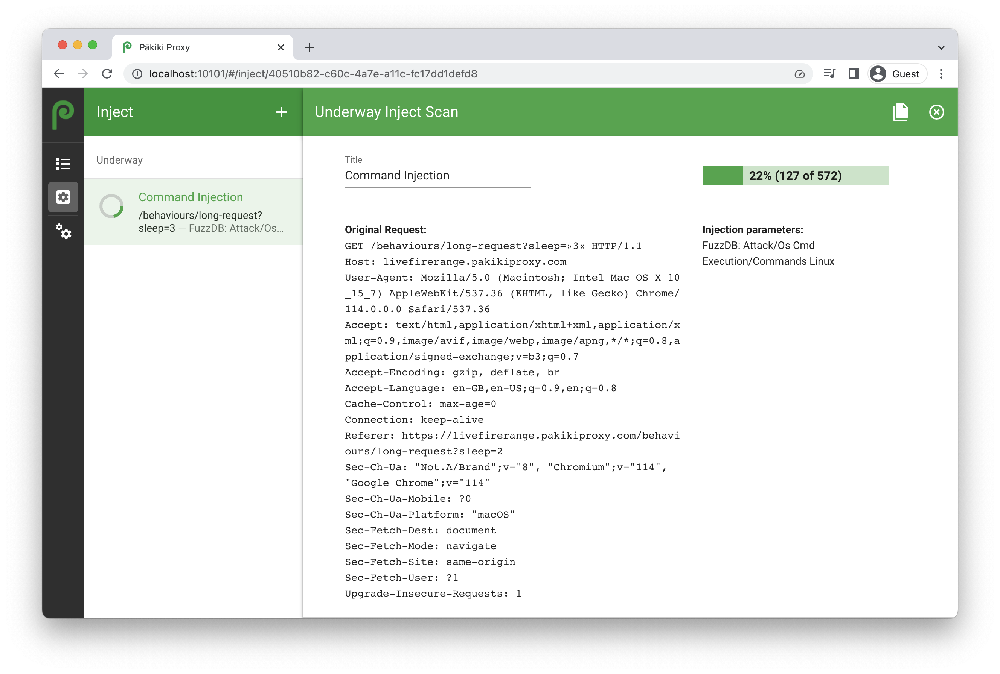

# Inject

The injection pane can be used for a variety of purposes, for example:
  * Attempting to identify injection flaws by sending a variety of fuzzing payloads to the server
  * Identify or exploit insecure direct object reference flaws
  * Brute force directories/files

<!-- tabs:start -->

#### **Linux**

<picture>
  <source media="(prefers-color-scheme: dark)" srcset="../_media/Linux/Dark/InjectProperties.png">
  
</picture>

#### **MacOS**

<picture>
  <source media="(prefers-color-scheme: dark)" srcset="../_media/Mac/Dark/InjectProperties.png">
  
</picture>

#### **Web**

<picture>
  <source media="(prefers-color-scheme: dark)" srcset="../_media/Web/Dark/InjectProperties.png">
  
</picture>

<!-- tabs:end -->

To send a request to the inject pane start by right-clicking on the request within the Requests pane, and click "Inject". If you’re using the web interface, then you should select the request, then click the “Send To” button to send the request to inject.

When crafting a new injection scan, you can set the following options:
  * **Title** - Used to help track which scans are being run. Example names might be "SQL Injection on Login Form" or "Brute force usernames".
  * **Host** - Used to specify which hostname the injection scan should be run against, for example "livefirerange.pakikiproxy.com".
  * **Find** - Allows you to find a specific request to base the request off.
  * **Request** - The contents of the request. You need to select where to inject the payloads within the request. You can do this by selecting part of the request and then clicking the "Add Separator" button.
  * **Payloads** - You can select different types of payloads to inject into the request:
    * FuzzDB - A large variety of premade payload lists. These include wordlists for username/password brute forcing, file enumeration, and payloads to detect/exploit injection flaws such as SQL injection, XSS, LDAP injection, etc. You can use the filter function to find the payload you want.
    * Custom Files - Load your own custom files with payload lists. These should be text files with a single payload per line.
    * Iterate - Iterate from/to specific numbers.

    You can select payloads from one or more of the payload tabs.

Once you have filled out the fields, click the run button to begin the inject scan:

<!-- tabs:start -->

#### **Linux**

<picture>
  <source media="(prefers-color-scheme: dark)" srcset="../_media/Linux/Dark/InjectRunning.png">
  
</picture>

#### **MacOS**

<picture>
  <source media="(prefers-color-scheme: dark)" srcset="../_media/Mac/Dark/InjectRunning.png">
  
</picture>

#### **Web**

<picture>
  <source media="(prefers-color-scheme: dark)" srcset="../_media/Web/Dark/InjectRunning.png">
  
</picture>

<!-- tabs:end -->

You can then sort the requests by column and use the request filter to identify requests of interest. For example, status code can be used to tell if a resource has been identified or a particular request has been successful, the content size can be used to determine if a different amount of data has been returned than usual, and the request duration can be used to determine if a request took longer to process or return than usual.

Once an inject scan is running or has been completed, the following options are available:
  * **Cancel** - If the scan is running, you can cancel it.
  * **Archive** - The left-hand bar of the requests view is sorted in the following order: New/unstarted scans, Underway, Completed, Archived. The archive button moves a scan from the completed list to the archived list. Scans can also be unarchived.
  * **Clone** - Create a new inject scan based off the existing one.