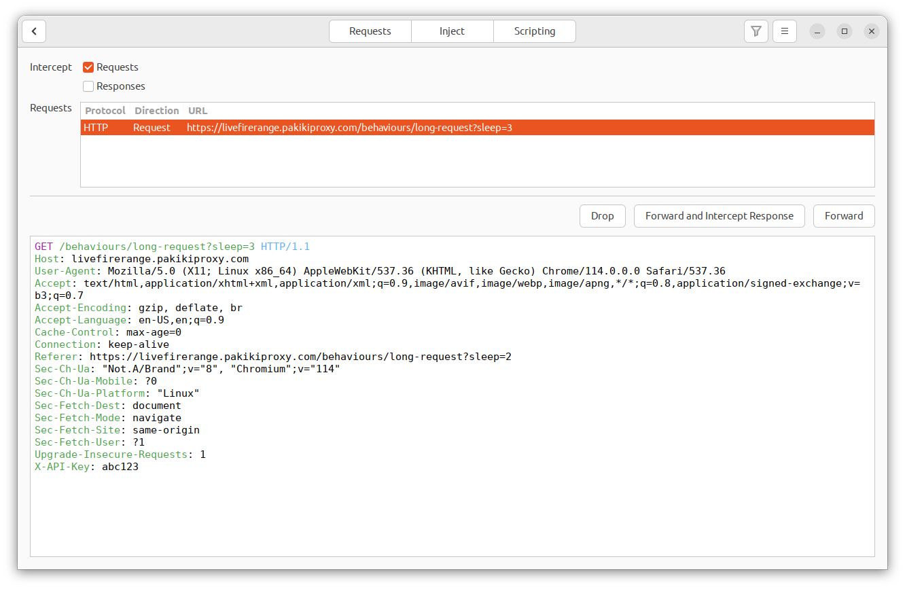
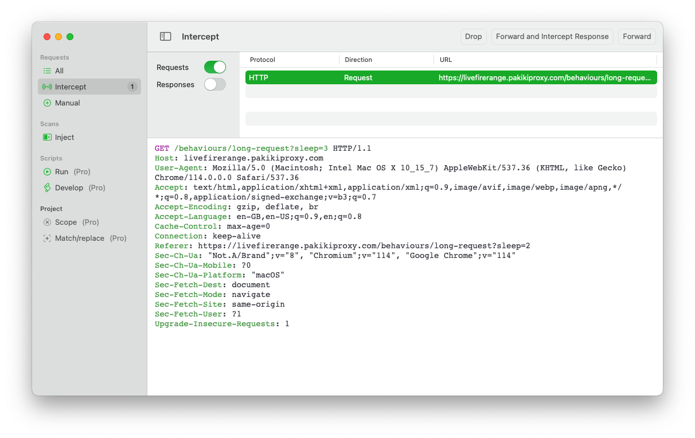

# Intercept

The intercept pane is where you can request that Pākiki halt in-flight requests and awaits your input on whether to forward them as-is, modify them, or drop them.

As requests are received from the web browser, they enter the request queue within the intercept pane. You can either forward/modify each request individually in the order they came in, or select a particular request to interact with.

Multiple requests can be selected to either forward or drop multiple at once.

<!-- tabs:start -->

#### **Linux**

<picture>
  <source media="(prefers-color-scheme: dark)" srcset="../_media/Linux/Dark/Intercept.png">
  
</picture>

#### **MacOS**

<picture>
  <source media="(prefers-color-scheme: dark)" srcset="../_media/Mac/Dark/Intercept.png">
  
</picture>

<!-- tabs:end -->

To access intercept, on Linux click the Intercept button in the top-left corner of the Requests pane. On MacOS select Intercept from the left-hand sidebar.