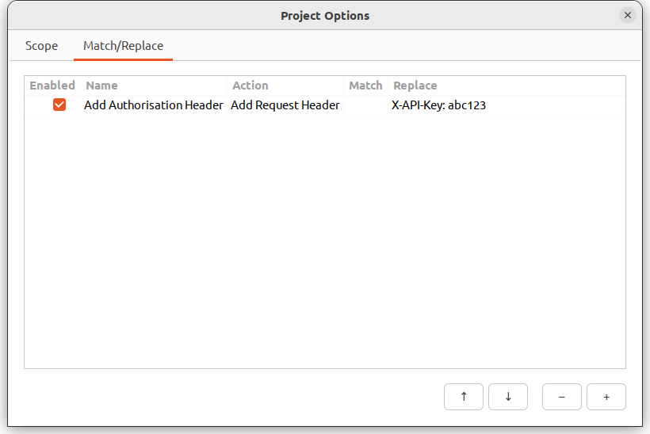
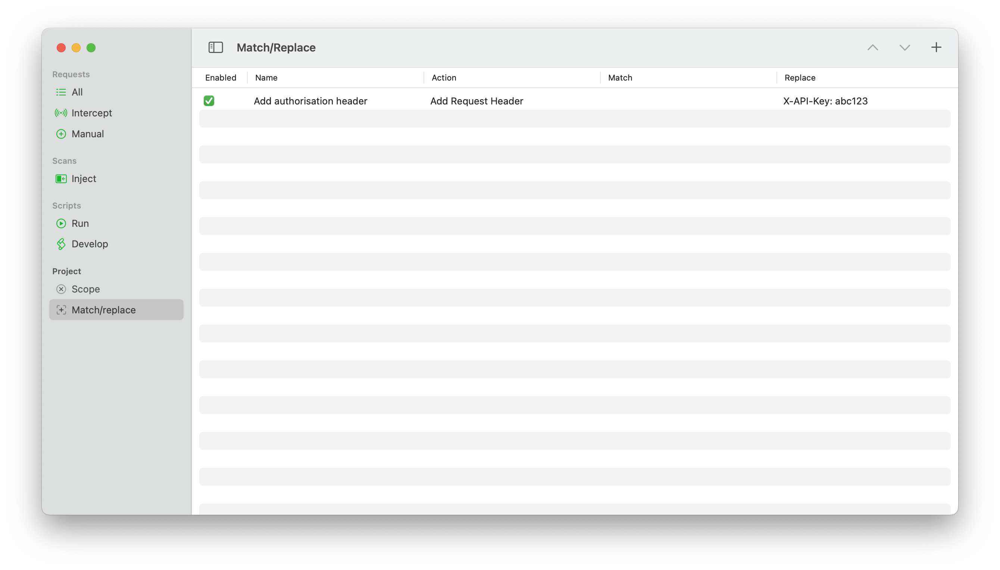

# Match/replace

It is possible to modify requests/responses as they are in transit to/from the browser automatically. These modifications will be taken into account before they are sent for manual interception/modification (if enabled).

<!-- tabs:start -->

#### **Linux**

<picture>
  <source media="(prefers-color-scheme: dark)" srcset="../_media/Linux/Dark/MatchReplace.png">
  
</picture>

#### **MacOS**

<picture>
  <source media="(prefers-color-scheme: dark)" srcset="../_media/Mac/Dark/MatchReplace.png">
  
</picture>

<!-- tabs:end -->

The following types of actions can be taken:
  * Adding headers
  * Modifying headers
  * Modifying a request/response's body

Matches are done with regular expressions, and the match/replace rules are executed in-order.

 > The match/replace rules only apply to proxied requests, they do not get applied to scripts or injection scans.

Match/Replace can be accessed via the Project Options from the top right-hand three bar/hamburger menu on Linux, or via Match/Replace on the left-hand sidebar on MacOS.