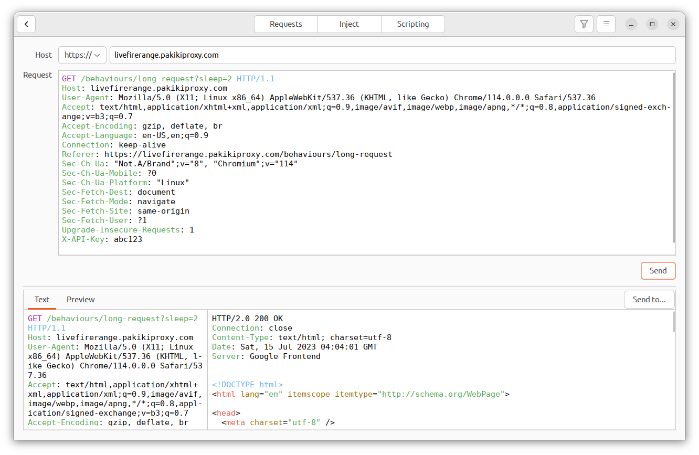
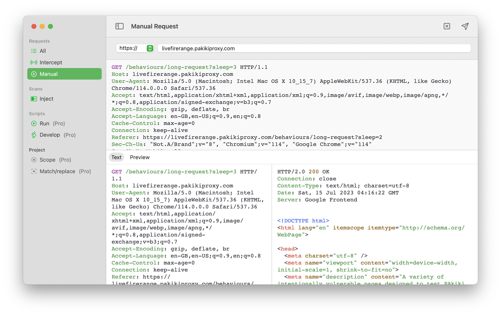
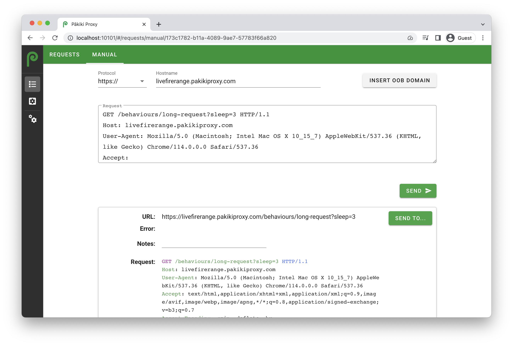

# New Requests

The new requests pane allows you to craft or modify new requests by hand, and then view the response from the server.

<!-- tabs:start -->

#### **Linux**

<picture>
  <source media="(prefers-color-scheme: dark)" srcset="../_media/Linux/Dark/MakeRequest.png">
  
</picture>

#### **MacOS**

<picture>
  <source media="(prefers-color-scheme: dark)" srcset="../_media/Mac/Dark/MakeRequest.png">
  
</picture>

#### **Web**

<picture>
  <source media="(prefers-color-scheme: dark)" srcset="../_media/Web/Dark/MakeRequest.png">
  
</picture>

<!-- tabs:end -->

To access it, on:
  * Linux - From the Requests pane, click "New" in the top-left hand corner.
  * MacOS - Select Manual from the left-hand sidebar.
  * Web - Click the Manual tab at the top of the Requests pane.

To send a request to the manual request pane, right click on the request and select "New Request". In the web client, select the request, then select "New Request" from the Send To menu.