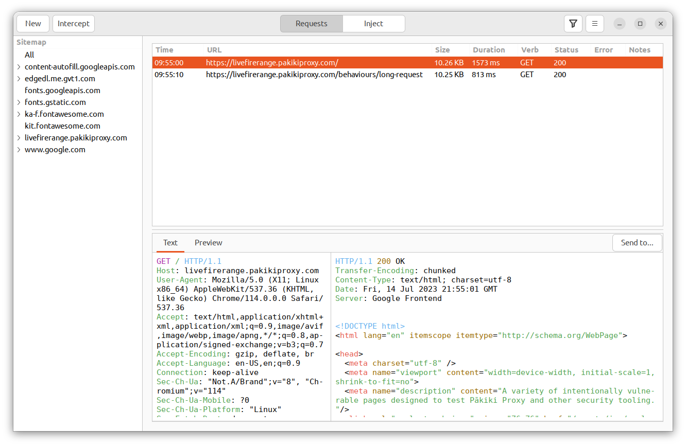
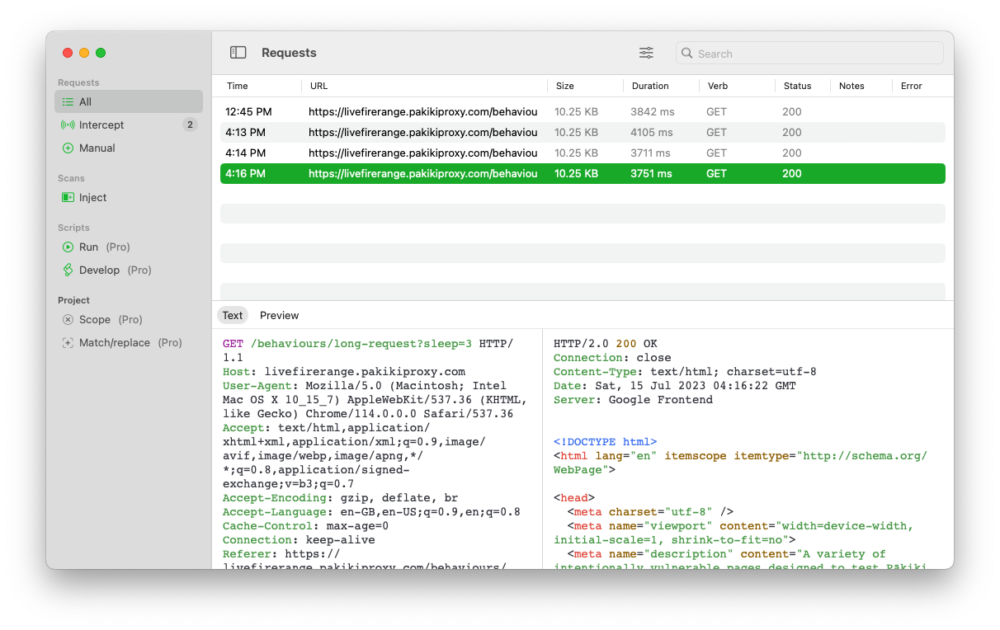
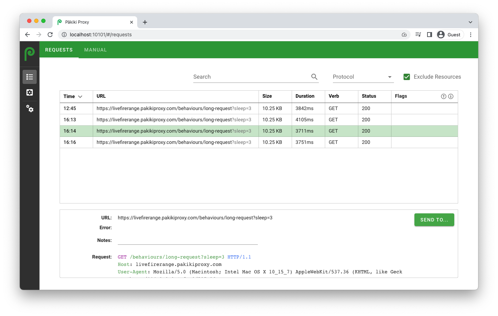
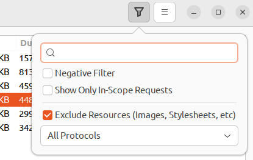
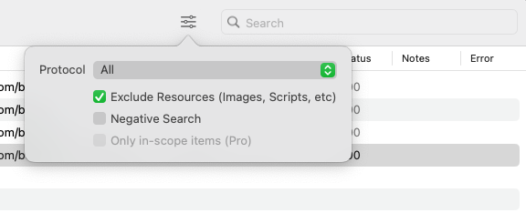
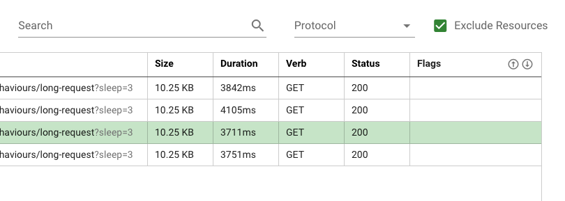

# Requests

The requests pane is where all requests which have been made by the proxy can be found. It is possible to sort and filter the requests. By clicking on a request, you can view the request and response, and view a rendered preview of it. Requests can be of multiple types:
 * HTTP
 * Websockets
 * Out of Band interactions

By right-clicking on a request, you can send it to the other tools within Pākiki. You can also select parts of requests/responses and send the selection to CyberChef for further analysis or decoding.

 > Due to limitations on MacOS, resources (for example images, stylesheets, etc) will be loaded from the original sources when you are previewing a site. You should exercise caution if you are attempting to be stealthy, or no longer have permission to access a particular domain. On Linux, the preview pane will request resources from the proxy's internal database. This means that if those resources haven't been requested via the proxy, the preview may not render properly.

<!-- tabs:start -->

#### **Linux**

<picture>
  <source media="(prefers-color-scheme: dark)" srcset="../_media/Linux/Dark/Requests.png">
  
</picture>

#### **MacOS**

<picture>
  <source media="(prefers-color-scheme: dark)" srcset="../_media/Mac/Dark/Requests.png">
  
</picture>

#### **Web**

<picture>
  <source media="(prefers-color-scheme: dark)" srcset="../_media/Web/Dark/Requests.png">
  
</picture>

<!-- tabs:end -->

## Filtering

<!-- tabs:start -->

#### **Linux**

<picture>
  <source media="(prefers-color-scheme: dark)" srcset="../_media/Linux/Dark/RequestFiltering.png">
  
</picture>

#### **MacOS**

<picture>
  <source media="(prefers-color-scheme: dark)" srcset="../_media/Mac/Dark/RequestFiltering.png">
  
</picture>

#### **Web**

<picture>
  <source media="(prefers-color-scheme: dark)" srcset="../_media/Web/Dark/RequestFiltering.png">
  
</picture>

<!-- tabs:end -->

It is possible to filter the request list based on the following factors:

  * **Text Search** - Search for a particular string within each request/response.
  * **Negative Search** - Exclude the requests which match the text search.
  * **Protocol** - Filter to only HTTP requests, WebSockets or Out of Band requests.
  * **Exclude Resources** - Resources include the images, stylesheets, fonts, javascript which is loaded as part of requests. These often pollute the request list, so they are hidden by default.
  * **Only in-scope requests (Pro only)** - Limit the request view to only the requests which are in-scope.