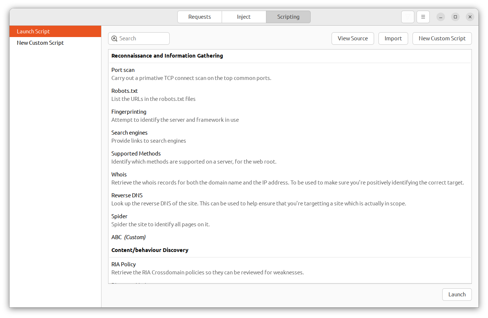
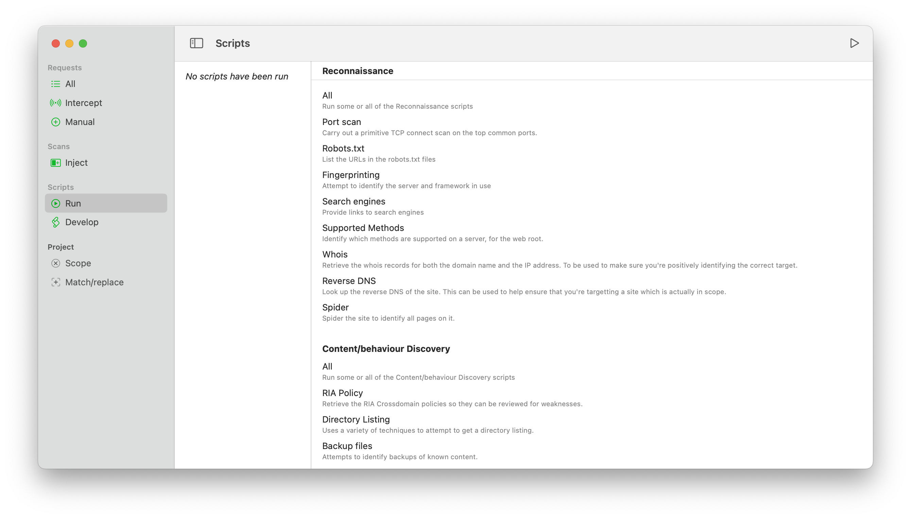
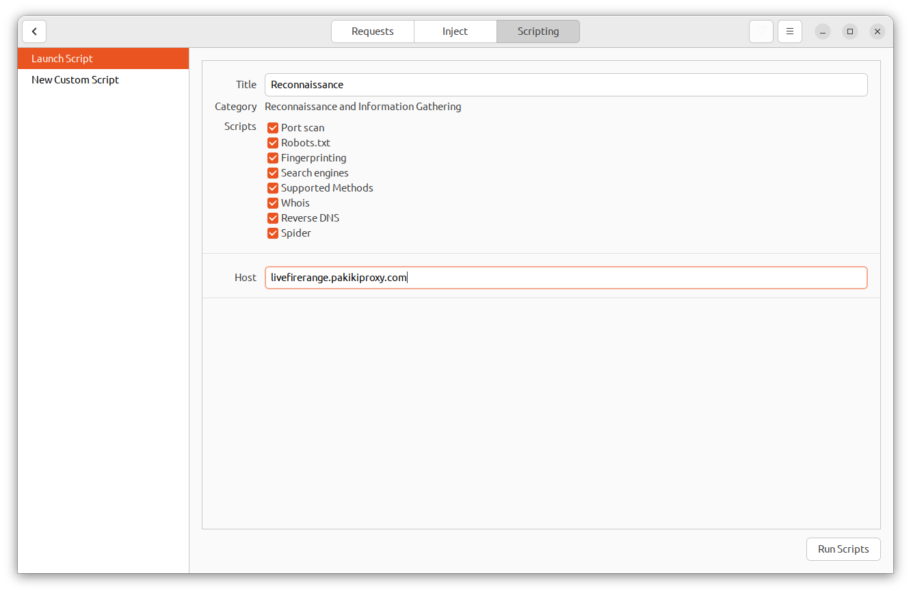
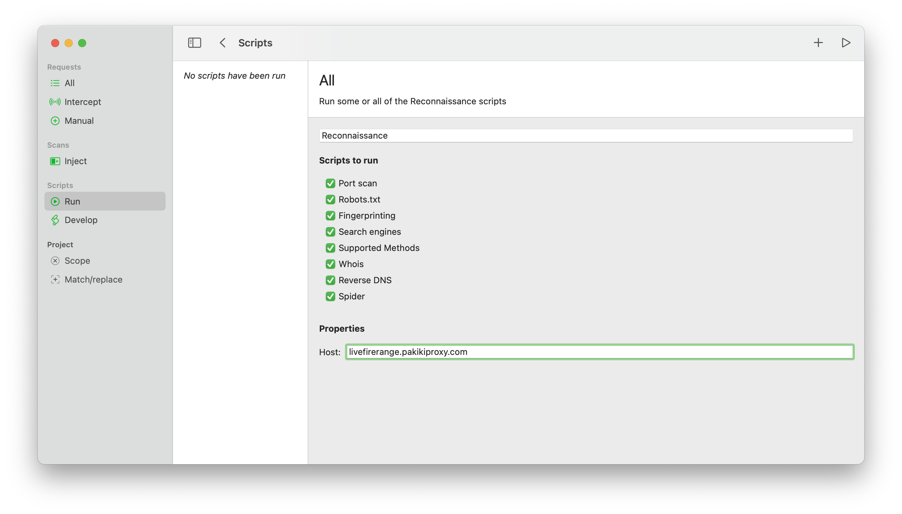
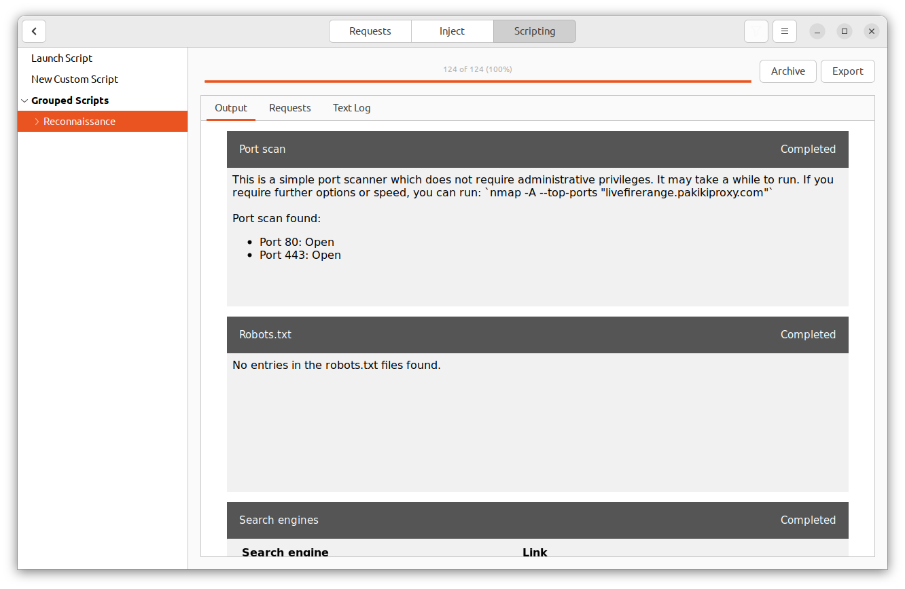
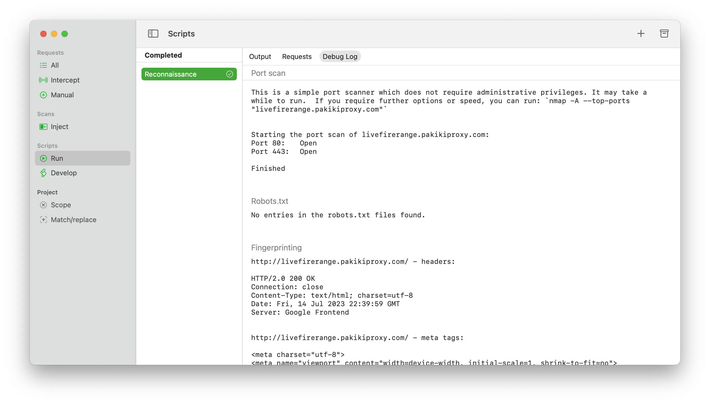

# Running scripts

## Overview

The professional versions of Pākiki come with a number of scripts which assist with recon, content discovery, and identification and exploitation of common web application vulnerabilities.

You can run either a single script, or an entire category of scripts.

<!-- tabs:start -->

#### **Linux**

<picture>
  <source media="(prefers-color-scheme: dark)" srcset="../_media/Linux/Dark/RunScriptList.png">
  
</picture>

#### **MacOS**

<picture>
  <source media="(prefers-color-scheme: dark)" srcset="../_media/Mac/Dark/RunScriptList.png">
  
</picture>

<!-- tabs:end -->

## Running a script

To run a script from the requests pane: Right-click on a request, and click Send To > [Script Category] > [The script you want], or all if you want all of the scripts in that category to be run against it.

Alternatively on MacOS select Run on the left-hand side menu, and under Linux select the Scripting Pane and select Launch Script if it is not already selected. You will then be presented with a list of scripts which are available to be run. You can double-click on any individual script, or on the title of a script category. You will then be presented with the details of the particular script you selected, or the category as a whole, and be prompted to enter any parameters which the script requires:

<!-- tabs:start -->

#### **Linux**

<picture>
  <source media="(prefers-color-scheme: dark)" srcset="../_media/Linux/Dark/RunScriptGroup.png">
  
</picture>

#### **MacOS**

<picture>
  <source media="(prefers-color-scheme: dark)" srcset="../_media/Mac/Dark/RunScriptGroup.png">
  
</picture>

<!-- tabs:end -->

You can then select run to begin running the script.

## Script Output
As a script is running, and once it is completed, there are three views:
  * **Output** - This is the primary report which the particular script generates. It's in HTML format, and will present the key information that the script has identified.
  * **Requests** - This contains request view showing all requests made by the script and their associated responses.
  * **Debug** - Shows the console/text-based output of the script. This can be useful for diagnosing problems.

<!-- tabs:start -->

#### **Linux**

<picture>
  <source media="(prefers-color-scheme: dark)" srcset="../_media/Linux/Dark/ReconOutput.png">
  
</picture>

#### **MacOS**

<picture>
  <source media="(prefers-color-scheme: dark)" srcset="../_media/Mac/Dark/ReconOutput.png">
  
</picture>

<!-- tabs:end -->

## Importing scripts
If another developer has created a Pākiki script you would like to run you can import this by either clicking the Import button at the top of the Scripts list on Linux, or selecting Script > Import from the menubar on MacOS.

Imported and custom scripts are associated with your local install rather than associated with a Project, however the script output and details are stored within the project so that other people can see and review what you have run against a target if you are working as part of a team.

## Modifying scripts
The source code to the built-in scripts can be viewed and modified by right-clicking on the script and clicking "Clone Script" or "View Source". This will take you to the development interface where you can either review the code for a better understanding of what the script is doing, or use it as the base for other custom scripts.

 > The built-in scripts are commercially licenced. Please do not redistribute the code, or redistribute your own scripts which are based on them.