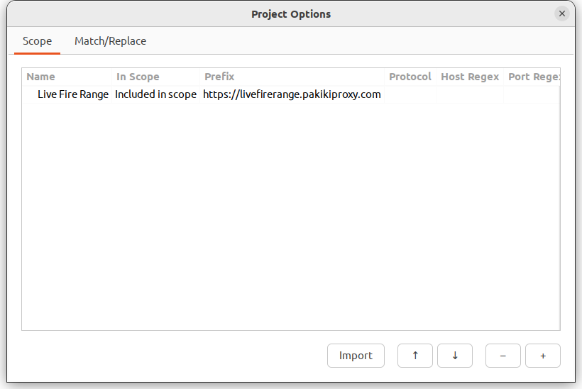
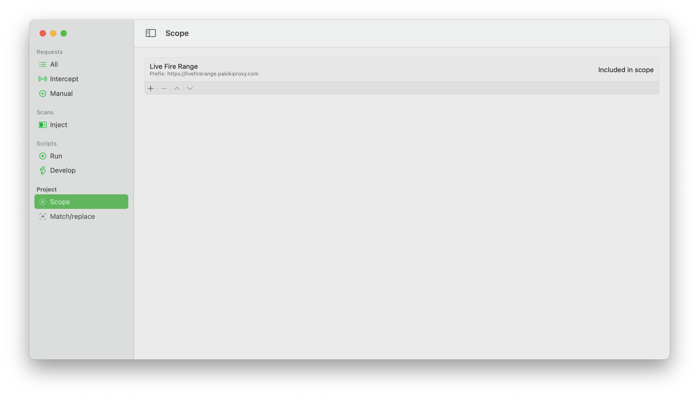

# Scopes

It is possible to define scopes which can be used elsewhere within Pākiki. You define scope rules which either explicitly include a request in scope or exclude a request from scope. The rules are applied in the specified order to determine whether a particular request is in scope. To make a scope rule, you can either specify a basic prefix (EG: `https://livefirerange.pakikiproxy.com/path/`) or specify regular expressions for the host, port and file part of the URL. If any scopes are set for a project, it is assumed that any URL which does not match a scope is out of scope.

You can also import scopes from bug bounty programs.

 > Scopes are only used for filtering the request views at this point. They **are not** taken into account when launching inject scans or scripts. Please be careful that scripts and inject scans will not cause harm to your target site.

<!-- tabs:start -->

#### **Linux**

<picture>
  <source media="(prefers-color-scheme: dark)" srcset="../_media/Linux/Dark/Scope.png">
  
</picture>

#### **MacOS**

<picture>
  <source media="(prefers-color-scheme: dark)" srcset="../_media/Mac/Dark/Scope.png">
  
</picture>

<!-- tabs:end -->

Scope can be accessed via the Project Options from the top right-hand three bar/hamburger menu on Linux, or via Scope on the left-hand sidebar on MacOS.