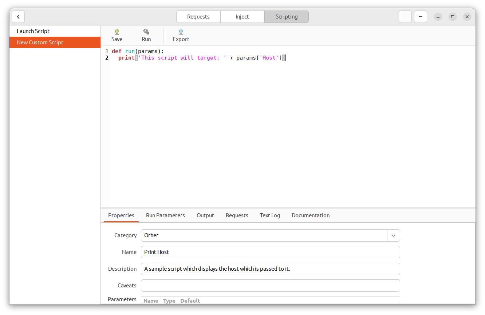
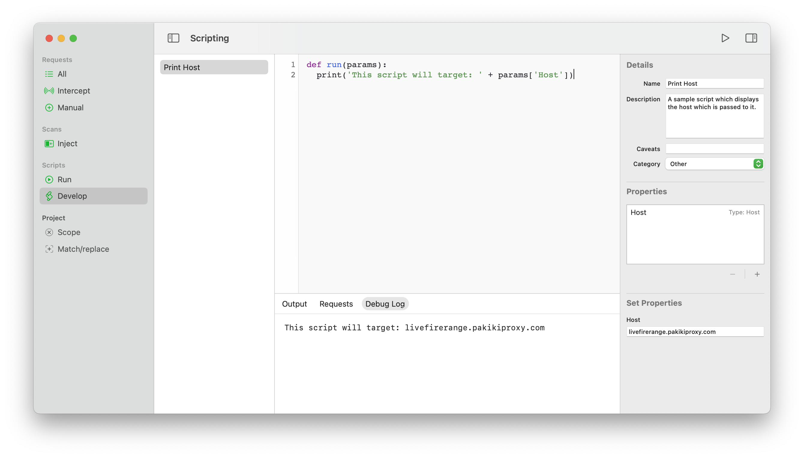

# Script Development

Custom scripts can be written in Python which can be used to automate discovery or exploitation of vulnerabilities.

<!-- tabs:start -->

#### **Linux**

<picture>
  <source media="(prefers-color-scheme: dark)" srcset="../_media/Linux/Dark/ScriptDevelopment.png">
  
</picture>

#### **MacOS**

<picture>
  <source media="(prefers-color-scheme: dark)" srcset="../_media/Mac/Dark/ScriptDevelopment.png">
  
</picture>

<!-- tabs:end -->

The development interface has the following features:
  * **Scripts list** Along the left-hand side, there's a list of the scripts which are under development.
  * **Code pane** The main pane of the development window consists of the code editor.
  * **Script details** Either along the right-hand side (on MacOS) or as a tab below the code editor (on Linux) are the script's properties. You can use this to set the name of the script, a description which will be shown in the script run list, any caveats that users should be aware of, etc.
  * **Script parameters** Scripts can take custom parameters which are either set by the user or when requests are sent to a script. For example, one might be the hostname of the target, and another might be the payload list to use. This tab or section within the sidebar is where you can set both which parameters the script takes, along with the values that should be passed to the script when running it within development mode.
  * **Output tab** The script's HTML output will be shown here when it is run.
  * **Requests tab** The requests the script made will be shown here when it runs.
  * **Text/Debug Log tab** Any output on stdout from the script (EG: anything from the `print` statement) will be shown here when the script is run.

By default, the `run` function will be called with the parameters when the script is executed. A very simple script which is passed a host as a parameter would look like:

```python
def run(params):
  print('This script will target: ' + params['Host'])
```

Further information on what scripts can do, including the API available to them can be found in either the Documentation Tab (on Linux) in Script > Scripting Documentation in the menubar on MacOS.