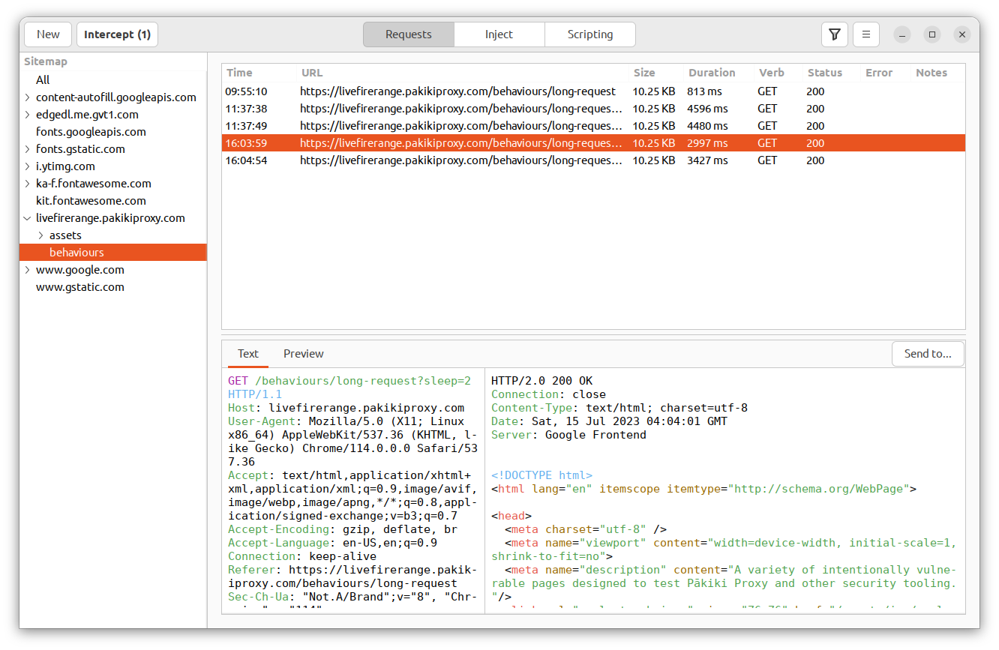
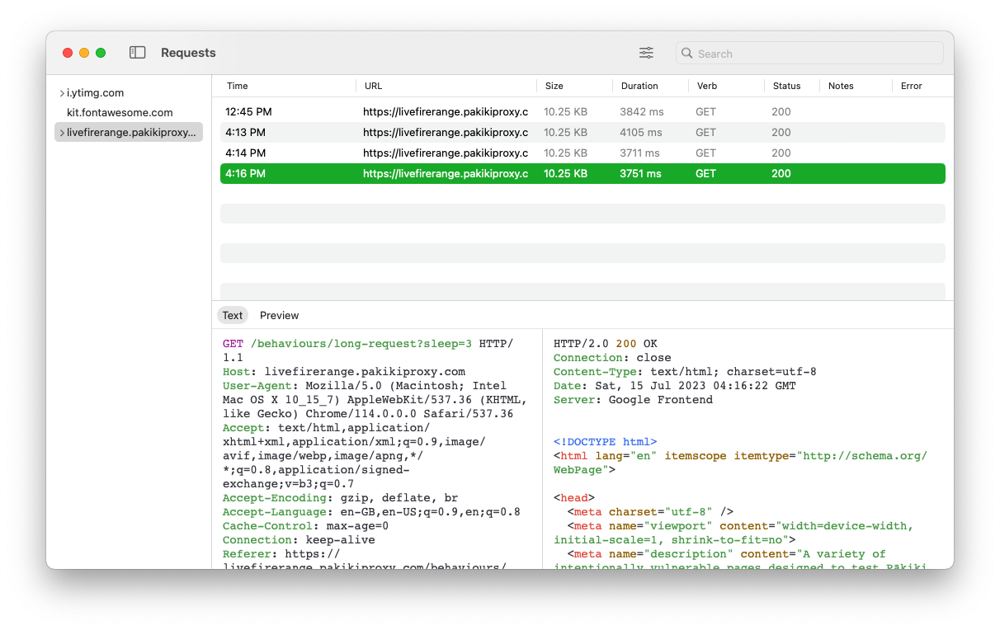

# Sitemap

The sitemap provides a tree-based list of all of the domains which have been visited, along with the URL paths within those domains. It allows you to quickly filter the requests by either the site or individual path that they were found on.

<!-- tabs:start -->

#### **Linux**

<picture>
  <source media="(prefers-color-scheme: dark)" srcset="../_media/Linux/Dark/Sitemap.png">
  
</picture>

#### **MacOS**

<picture>
  <source media="(prefers-color-scheme: dark)" srcset="../_media/Mac/Dark/Sitemap.png">
  
</picture>

<!-- tabs:end -->

To view the sitemap on Linux, from the left-hand side of the requests view, drag the sitemap open. To hide it, drag it back over to the side again.

To toggle it on MacOS, click View on the main menubar, then click "Show Sitemap".