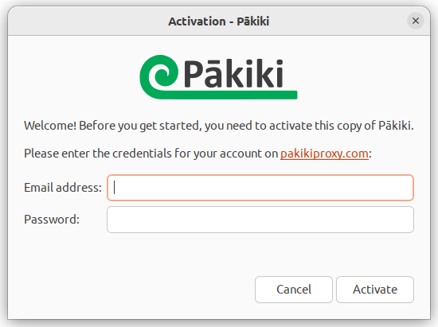
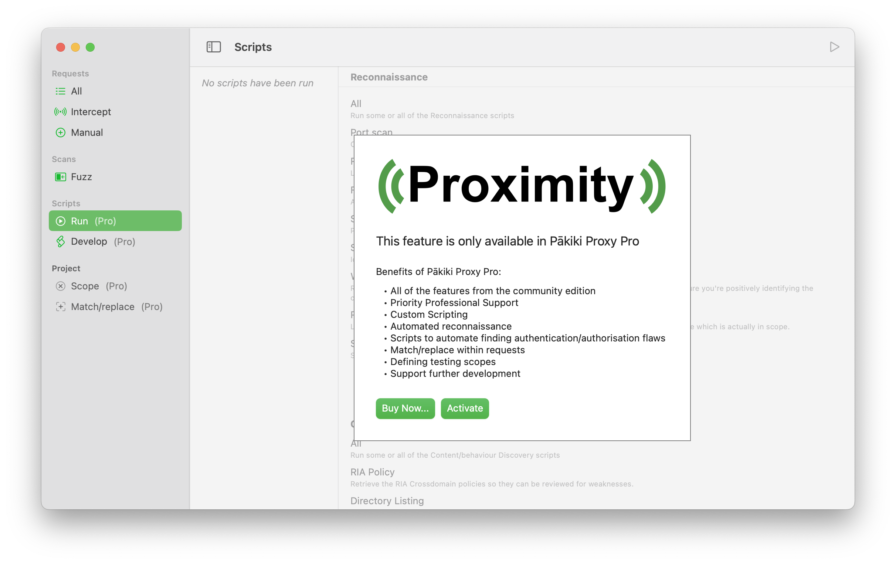
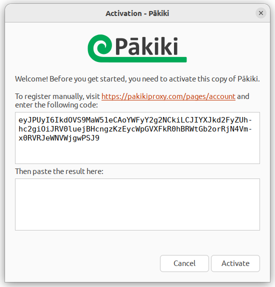
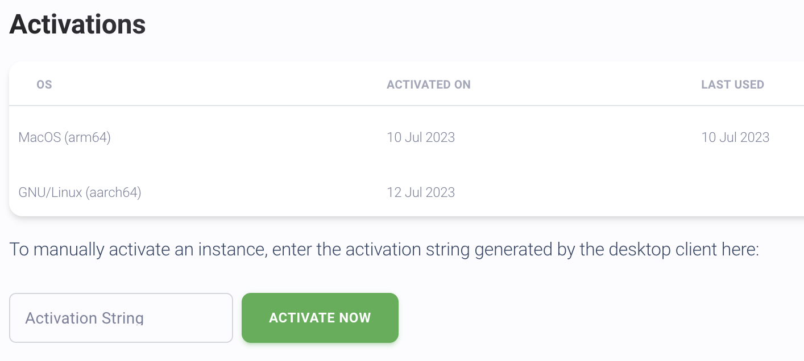

# Activation (Pro only)

## Automatic Activation
If you have an active Internet connection, you can activate Pākiki by entering your credentials into the prompt. If you have already activated too many instances, you can manage your account at: [https://pakikiproxy.com/pages/account](https://pakikiproxy.com/pages/account).

<!-- tabs:start -->

#### **Linux**

On launch of the professional version, a prompt will be displayed on launch allowing you to enter your credentials:

<picture>
  <source media="(prefers-color-scheme: dark)" srcset="../_media/Linux/Dark/ActivationPrompt.png">
  
</picture>

#### **MacOS**

When you attempt to access a feature only available within the professional version, you will be prompted to activate:

<picture>
  <source media="(prefers-color-scheme: dark)" srcset="../_media/Mac/Dark/ActivationPrompt.png">
  
</picture>

<!-- tabs:end -->

## Manual Activation (Linux only)
On Linux, if a connection to the activation server cannot be obtained then an activation string will be generated by the client and presented to you:

<picture>
  <source media="(prefers-color-scheme: dark)" srcset="../_media/Linux/Dark/ManualActivationPrompt.png">
  
</picture>

You can then enter this on your [https://pakikiproxy.com/pages/account](account) page, to receive the activation code to paste back into the application:

## Renewal
You will receive a notification before your licence is due to expire. When you renew your licence, the desktop clients should automatically receive the update. If they do not, you can reactivate Pākiki using the instructions above.

Pākiki makes a connection to the activation server on each launch to check if an update to the licence is available and to check for updates.

## Viewing Licence Details
You can view your licence details either online at [https://pakikiproxy.com/pages/account](https://pakikiproxy.com/pages/account), or via the application:

  * On Linux, these can be found in the About page.
  * On MacOS, these can be found in Settings on the Licence tab.