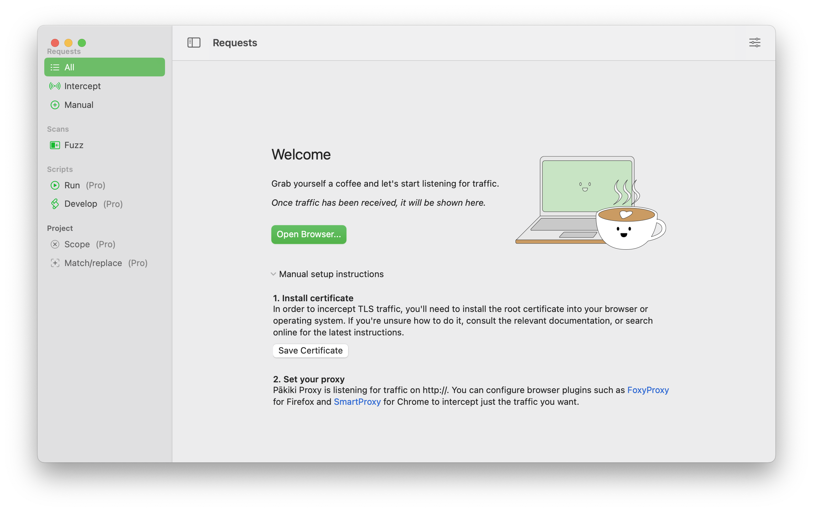
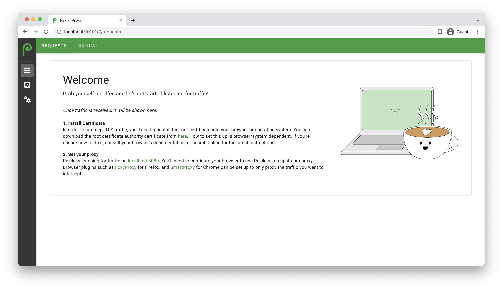
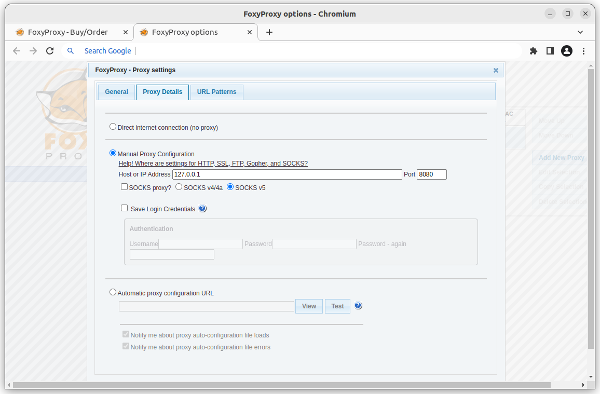
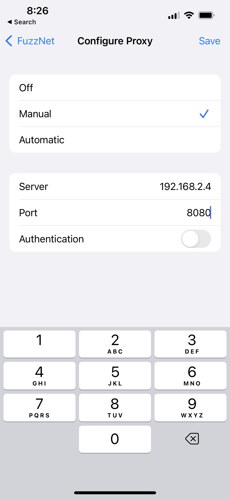

# Intercepting Traffic

## Embedded Browser

If you have Chromium or Google Chrome installed, Pākiki can launch this preconfigured to use the proxy. This is the easiest option to get started with.

<!-- tabs:start -->

#### **Linux**

*This only works in the Debian packaged versions of Pākiki, as the Flatpak versions are sandboxed and cannot launch the system browser outside of the sandbox.*

#### Welcome Page

When you first launch Pākiki and no requests have been made, a welcome page which will be shown with a button to directly open the embedded browser:

<picture>
  <source media="(prefers-color-scheme: dark)" srcset="../_media/Linux/Dark/OpenBrowser.png">
  
</picture>

#### Menu

If requests have been received, you can launch the embedded browser from the three bar/hamburger menu in the top right hand corner of the window:

<picture>
  <source media="(prefers-color-scheme: dark)" srcset="../_media/Linux/Dark/HamburgerMenu.png">
  
</picture>

#### **MacOS**

#### Welcome Page

When you first launch Pākiki and no requests have been made, a welcome page which will be shown with a button to directly open the embedded browser:

<picture>
  <source media="(prefers-color-scheme: dark)" srcset="../_media/Mac/Dark/OpenBrowser.png">
  
</picture>

#### Menu

If requests have been received, you can launch the embedded browser from the View menu:

<picture>
  <source media="(prefers-color-scheme: dark)" srcset="../_media/Mac/Dark/OpenBrowserView.png">
  
</picture>

<!-- tabs:end -->

## Manual Setup

Manual setup can be used if you're testing from another device (for example, via a mobile device, virtual machine, etc), or would prefer to test via a different browser.

It's worth remembering that when the certificate has been imported into a device, anybody with access to the corresponding Pākiki private key will be able to intercept traffic from that device or browser. Some tips to minimise the risks are:
  * If you're installing the certificate on another device for a specific engagement, remove it once you're done.
  * Ensure the machine you have Pākiki installed on has had appropriate security hardening carried out (is using full disk encryption, has updates applied, has as few listening services as possible, etc)
  * Don't leave the machine you have Pākiki installed on unattended while unlocked.

### Port and IP Binding

By default, the Pākiki proxy service listens on 127.0.0.1 on port 8080. This can be changed in the settings under "HTTP/1.1 proxy address". To listen on all interfaces, change this from `127.0.0.1:8080` to just `:8080`.

### Certificate Download

Firstly, you will need to download a copy of the Certificate Authority's certificate so that you have a copy of it to import into the other platforms.

<!-- tabs:start -->

#### **Linux**

#### Welcome Page
From the Welcome Page, expand the Manual Setup instructions, then click "Save Certificate" to find a location to save the certificate into.

<picture>
  <source media="(prefers-color-scheme: dark)" srcset="../_media/Linux/Dark/ManualSetup.png">
  
</picture>

#### Settings
From the three-bar hamburger menu in the top right hand corner of the window, select Preferences, then click "Save Certificate":

<picture>
  <source media="(prefers-color-scheme: dark)" srcset="../_media/Linux/Dark/Preferences.png">
  
</picture>

#### **MacOS**

#### Welcome Page
From the Welcome Page, expand the Manual Setup instructions, then click "Save Certificate" to find a location to save the certificate into.

<picture>
  <source media="(prefers-color-scheme: dark)" srcset="../_media/Mac/Dark/ManualSetup.png">
  
</picture>

#### Settings
From the menu bar, open the Pākiki Proxy menu, select Preferences, then click "Save Certificate":

<picture>
  <source media="(prefers-color-scheme: dark)" srcset="../_media/Mac/Dark/Preferences.png">
  
</picture>

#### **Web**

#### Welcome Page
From the Welcome Page, click the "Save Certificate" link to download the certificate into your downloads folder.

<picture>
  <source media="(prefers-color-scheme: dark)" srcset="../_media/Web/Dark/Introduction.png">
  
</picture>

#### Settings
From the right-hand menu, open the Settings, then click "Save Certificate" to download the certificate into your downloads folder.

<picture>
  <source media="(prefers-color-scheme: dark)" srcset="../_media/Web/Dark/Preferences.png">
  
</picture>

<!-- tabs:end -->

### Firefox

#### Certificate Import
Open the settings from the top-right hand three bar/hamburger menu. Then search the settings for certificates:

<picture>
  <source media="(prefers-color-scheme: dark)" srcset="../_media/Linux/Dark/FirefoxCertificatePreferences.png">
  
</picture>

Open the certificate manager, then select the "Authorities" tab if it is not already selected, then click "Import" to search for the certificate you saved:

<picture>
  <source media="(prefers-color-scheme: dark)" srcset="../_media/Linux/Dark/FirefoxCertificateManager.png">
  
</picture>

Finally select that you wish to trust it for websites.

#### Proxy Setup

[FoxyProxy](https://addons.mozilla.org/en-US/firefox/addon/foxyproxy-standard/) is recommended to make proxy server management easier.

Once you've installed the extension, open the options and add a new proxy (substituting the relevant settings if your Pākiki instance isn't on 127.0.0.1:8080):

<picture>
  <source media="(prefers-color-scheme: dark)" srcset="../_media/Linux/Dark/FoxyProxySettings.png">
  
</picture>

You can then select when to use which proxy from the FoxyProxy extension:
<picture>
  <source media="(prefers-color-scheme: dark)" srcset="../_media/Linux/Dark/FoxyProxyMenu.png">
  
</picture>

### Chrome

#### Certificate Import

*On MacOS and Windows, Chrome uses the system certificate authority, so follow the relevant instructions for importing the certificate into Windows or MacOS*

Open the Chrome settings, and search for Certificates, select Settings, then scroll to the bottom and click "Manage Certificates":

<picture>
  <source media="(prefers-color-scheme: dark)" srcset="../_media/Linux/Dark/ChromeCertificatePreferences.png">
  
</picture>

Click the Authorities tab, if it isn't already selected, then click "Import" to find the certificate that you previously downloaded:

<picture>
  <source media="(prefers-color-scheme: dark)" srcset="../_media/Linux/Dark/ChromeCertificateManager.png">
  
</picture>

#### Proxy Setup

Various extensions are available to help manage the proxy which you use in Chrome. [FoxyProxy](https://chrome.google.com/webstore/detail/foxyproxy-standard/gcknhkkoolaabfmlnjonogaaifnjlfnp/related) also works with Chrome. Once that is installed, on the configuration screen, click "Add New Proxy" on the right-hand side, and fill out the relevant sections:

<picture>
  <source media="(prefers-color-scheme: dark)" srcset="../_media/Linux/Dark/FoxyProxyChromeSettings.png">
  
</picture>

You can then select the proxy to use from the extension:

<picture>
  <source media="(prefers-color-scheme: dark)" srcset="../_media/Linux/Dark/FoxyProxyChrome.png">
  
</picture>

### Windows

#### Certificate Import

Firstly rename the certificate from .pem to .der - then double-click it to import it. Follow the import wizard, and when you are prompted for the Certificate Store, select "Trusted Root Certificatation Authorities", and then follow the rest of the wizard:

<picture>
  
</picture>

### MacOS

#### Certificate Import

Double-click the downloaded certificate to import it. Keychain Access should then show the imported certificate in the list. Double-click on the certificate and expand the trust settings, and select "Always Trust" for "Secure Sockets Layer (SSL)":

<picture>
  <source media="(prefers-color-scheme: dark)" srcset="../_media/Mac/Dark/KeychainTrustSettings.png">
  
</picture>

### Android

#### Certificate Import
Download the certificate onto the phone. Then open settings, search for certificates, then tap "Install a certificate". Tap "CA certificate", and then select the downloaded certificate.

#### Proxy Setup

From the Wifi settings, tap on the network you are connected to. Tap the edit button in the top-right hand corner, then expand advanced settings, and enter the proxy server's details:

<picture>
  <source media="(prefers-color-scheme: dark)" srcset="../_media/Linux/Dark/AndroidProxySettings.png">
  
</picture>

### iPhone/iPad

#### Certificate Import

Download the certificate, and then from the Files app, tap the certificate to start the import process. Open Settings, and observe there is a notification that a new profile has been installed. Tap that, and click Install. Enter your passcode. Then navigate back to the top of the settings Application, and search for certificates. Open the "Certificate Trust Settings" and then swipe to state that you trust the new certificate.

#### Proxy Setup

Open the settings for the wireless network you're connected to, scroll to the bottom and tap "Configure Proxy", then enter the settings:

<picture>
  <source media="(prefers-color-scheme: dark)" srcset="../_media/Mac/Dark/iPhoneProxySettings.png">
  
</picture>