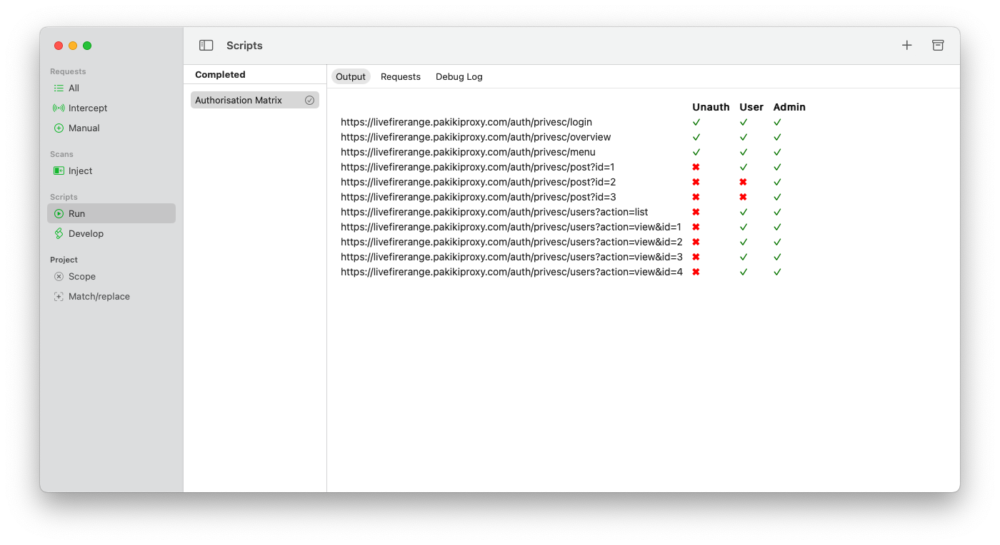
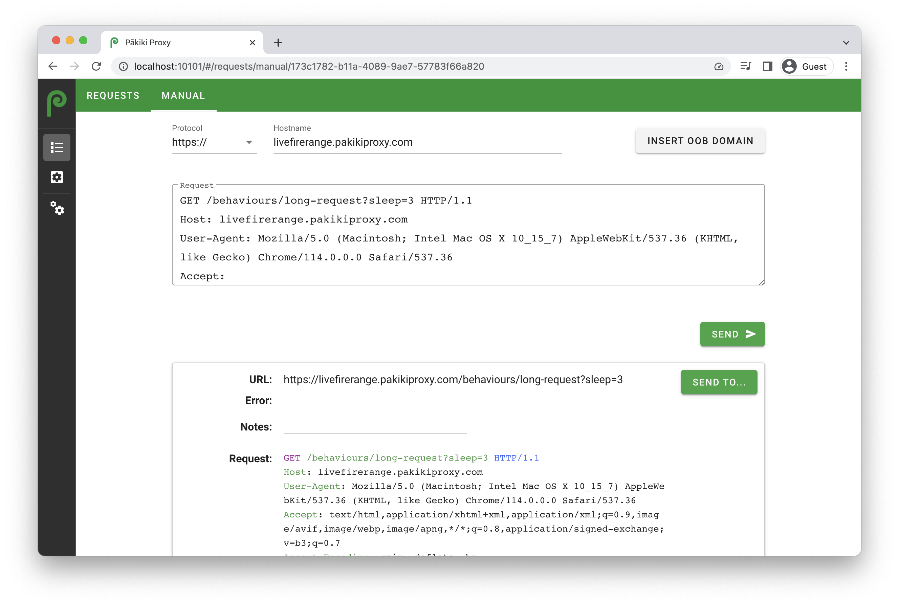

# Finding Privilege Escalation

Broadly the way to check for authorisation vulnerabilities is to log in with higher-privileged accounts and then perform actions with them, and observe the request structures. Then you replicate those exact requests while logged in as lower-privileged users.

It's much easier if you have documentation outlining what user roles are present within the application and what the intended permissions are.

## Automatic (Pro-only)

The professional version has a built-in script to assemble an authorisation matrix. It will browse to every URL within the given scope which has been encountered before, and make a request to that URL with the given cookies.

 > Note that destructive actions may be carried out if these are within the scope. Ensure that no previously-made requests are likely to result in data loss, unintended data corruption or loss of access.

To use it, right-click on a request on the site you want to target, then select Send to Script > Authentication / Authorisation > Authorisation Matrix.

Firstly confirm the scope, and ensure that only URLs you want are in scope.

Then add the cookies you want and specify their roles. The cookies should be obtained by logging into the site as each user, without signing out properly, then recording the session value. For example, you might have: `admin` with the cookie header of: `session=123456; user_id=1920` and another role/cookie of `Regular user` with the cookie header of: `session=9053892; user_id=932`. 

<!-- tabs:start -->

#### **Linux**

<picture>
  <source media="(prefers-color-scheme: dark)" srcset="../_media/Linux/Dark/AuthMatrixSettings.png">
  
</picture>

#### **MacOS**

<picture>
  <source media="(prefers-color-scheme: dark)" srcset="../_media/Mac/Dark/AuthMatrixSettings.png">
  
</picture>

<!-- tabs:end -->

Once the roles are entered, click run to start the report generation and review the authentication matrix which has been generated:

<!-- tabs:start -->

#### **Linux**

<picture>
  <source media="(prefers-color-scheme: dark)" srcset="../_media/Linux/Dark/AuthMatrixReport.png">
  
</picture>

#### **MacOS**

<picture>
  <source media="(prefers-color-scheme: dark)" srcset="../_media/Mac/Dark/AuthMatrixReport.png">
  
</picture>

<!-- tabs:end -->

## Manual

The are two broad approaches which can be used to manually check for privilege escalation. In both instances, the first step is to enumerate all of the application's functionality with a high privilege user. Then:

  1. For simple requests, you can log into your browser with a user with other permissions, then right click on the request in Pākiki, click Copy URL then paste that into your browser.
  1. For more complex requests, right-click the given request in Pākiki, then click "New Request" to send it to the window where you can modify the request. Copy and paste the cookies from the session of a user with a different permission-set, then click send and observe the result.

<!-- tabs:start -->

#### **Linux**

<picture>
  <source media="(prefers-color-scheme: dark)" srcset="../_media/Linux/Dark/MakeRequest.png">
  
</picture>

#### **MacOS**

<picture>
  <source media="(prefers-color-scheme: dark)" srcset="../_media/Mac/Dark/MakeRequest.png">
  
</picture>

#### **Web**

<picture>
  <source media="(prefers-color-scheme: dark)" srcset="../_media/Web/Dark/MakeRequest.png">
  
</picture>

<!-- tabs:end -->