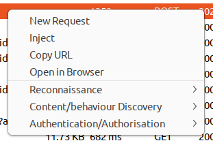
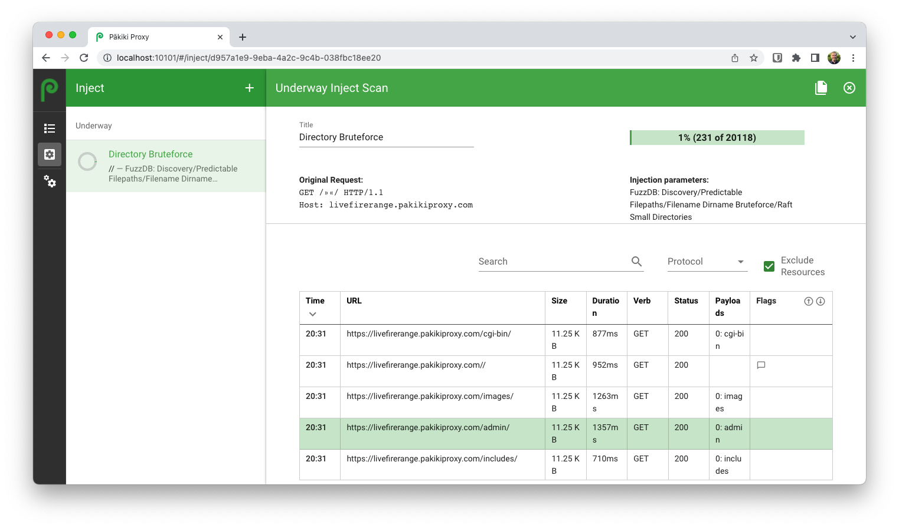

# Hidden Files

## Automated (Pro-only)

The built-in scripts to attempt to identify hidden files will use the knowledge of the existing paths and directories on the site. As such, it is important to have either spidered the site and/or enumerated the site's functionality manually before running the scripts to give them the best chance to find the files.

To automatically attempt to identify hidden files and understand the server's behaviour on a given site, browse to the site's home page, right click on a request, and then click Send to > Content/behaviour Discovery > All. If necessary, customise which specific discovery tasks are carried out, then click run.

Wait for the script to finish running, then view the report.

By default, this will run scripts which:
 * Display the RIA Crossdomain Policy (if present).
 * Attempt to exploit directory disclosure vulnerabilities in the underlying technologies, and search for Git indexes.
 * Take all of the existing known files and paths on the site, and append common backup file extensions such as `.bak` and prepend them `Copy_of_`, etc.
 * Make requests to the server of known files with a different file extension (one per path) and also to index.extension - to understand what automatic file handling a framework may be doing. For example, if a framework automatically serialises objects based on the file path, `/users/1.json` may return just selected fields within the JSON, but the developers may not have customised `/users/1.xml` and you may be able to get password hashes.
 * Attempt to brute force files and directories using the given wordlist.

 <!-- tabs:start -->

#### **Linux**

<picture>
  <source media="(prefers-color-scheme: dark)" srcset="../_media/Linux/Dark/ContentDiscovery.png">
  
</picture>

#### **MacOS**

<picture>
  <source media="(prefers-color-scheme: dark)" srcset="../_media/Mac/Dark/ContentDiscovery.png">
  
</picture>

<!-- tabs:end -->

## Manual

While there are a number of different techniques to potentially find hidden files or directories, the one which most commonly returns results is brute forcing.

To brute force filenames or directory paths start by right-clicking on a GET request on the site, and click "Inject". If you're using the web interface, then you should select the request, then click the "Send To" button to send the request to inject.

<!-- tabs:start -->

#### **Linux**

<picture>
  <source media="(prefers-color-scheme: dark)" srcset="../_media/Linux/Dark/RightClickInject.png">
  
</picture>

#### **MacOS**

<picture>
  <source media="(prefers-color-scheme: dark)" srcset="../_media/Mac/Dark/RightClickInject.png">
  
</picture>

#### **Web**

<picture>
  <source media="(prefers-color-scheme: dark)" srcset="../_media/Web/Dark/SendToInject.png">
  
</picture>

<!-- tabs:end -->

On the injection details pane:
  1. Enter a title (for example "Filename Bruteforce")
  1. Ensure the target host and request are correct
  1. Select the part of the path that you want to inject into, and click the "Add Separator" button. For example, if you wanted to search for hidden files within the web root. The first line should be along the lines of: `GET /index.html HTTP/1.1` with the separators around the `index.html` part. An example of this is included below. If you wanted to do a brute force attack for other directories, then the first line should be along the lines of `GET /directory/ HTTP/1.1` with the separators around the word `directory` leaving the slashes in-tact.
  1. From the payloads list, select a relevant wordlist. The Raft Files or Directories lists are likely suitable. You can hover over a given payload list to see some examples of the payloads to make sure they make sense in the context of where you're injecting them into.
  1. Finally click run in the top right-hand corner of the window

This will then start attempting to find directories on the server. You can sort by fields such as the HTTP Status, the Size or Duration to find any successful requests:

<!-- tabs:start -->

#### **Linux**

<picture>
  <source media="(prefers-color-scheme: dark)" srcset="../_media/Linux/Dark/DirectoryBruteforce.png">
  
</picture>

#### **MacOS**

<picture>
  <source media="(prefers-color-scheme: dark)" srcset="../_media/Mac/Dark/DirectoryBruteforce.png">
  
</picture>

#### **Web**

<picture>
  <source media="(prefers-color-scheme: dark)" srcset="../_media/Web/Dark/DirectoryBruteforce.png">
  
</picture>

<!-- tabs:end -->