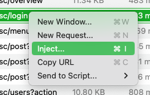

# Password Bruteforce

 > Before attempting a brute force attack you should ensure that you will not lock out valid user accounts or lock out accounts which you will otherwise need for your work.

To brute force a password on a login form start by right-clicking on the request which has the username/password field in it, and click "Inject". If you're using the web interface, then you should select the request, then click the "Send To" button to send the request to inject.

<!-- tabs:start -->

#### **Linux**

<picture>
  <source media="(prefers-color-scheme: dark)" srcset="../_media/Linux/Dark/RightClickInject.png">
  
</picture>

#### **MacOS**

<picture>
  <source media="(prefers-color-scheme: dark)" srcset="../_media/Mac/Dark/RightClickInject.png">
  
</picture>

#### **Web**

<picture>
  <source media="(prefers-color-scheme: dark)" srcset="../_media/Web/Dark/SendToInject.png">
  
</picture>

<!-- tabs:end -->

On the injection details pane:
  1. Enter a title (for example "Password Bruteforce")
  1. Ensure the target host and request are correct
  1. If it's not already automatically selected, select the password's value (in the case below "abc") and then click the "Add Separator" button. Remove any other injection points which may have been automatically added (for example, username fields), by either backspacing the separator characters, or highlighting the part of the request with the additional separators and clicking "Clear Separators".
  1. From the payloads list, select a suitable password list to attempt. In the case below, we've chosen the list from John the Ripper.
  1. Finally click run in the top or bottom right-hand corner of the window (depending on the platform).

<!-- tabs:start -->

#### **Linux**

<picture>
  <source media="(prefers-color-scheme: dark)" srcset="../_media/Linux/Dark/PasswordBruteForceRequestProperties.png">
  
</picture>

#### **MacOS**

<picture>
  <source media="(prefers-color-scheme: dark)" srcset="../_media/Mac/Dark/PasswordBruteForceRequestProperties.png">
  
</picture>

#### **Web**

<picture>
  <source media="(prefers-color-scheme: dark)" srcset="../_media/Web/Dark/PasswordBruteForceRequestProperties.png">
  
</picture>

<!-- tabs:end -->

This will then start brute-forcing the login form. You can sort by fields such as the HTTP Status, the Size or Duration to find any successful requests:

<!-- tabs:start -->

#### **Linux**

<picture>
  <source media="(prefers-color-scheme: dark)" srcset="../_media/Linux/Dark/PasswordBruteForceRequestList.png">
  
</picture>

#### **MacOS**

<picture>
  <source media="(prefers-color-scheme: dark)" srcset="../_media/Mac/Dark/PasswordBruteForceRequestList.png">
  
</picture>

#### **Web**

<picture>
  <source media="(prefers-color-scheme: dark)" srcset="../_media/Web/Dark/PasswordBruteForceRequestList.png">
  
</picture>

<!-- tabs:end -->