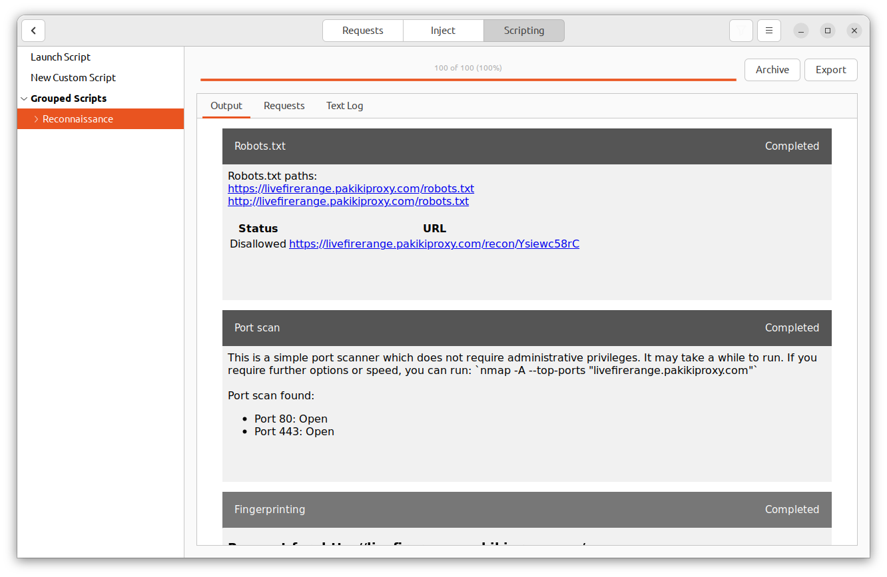
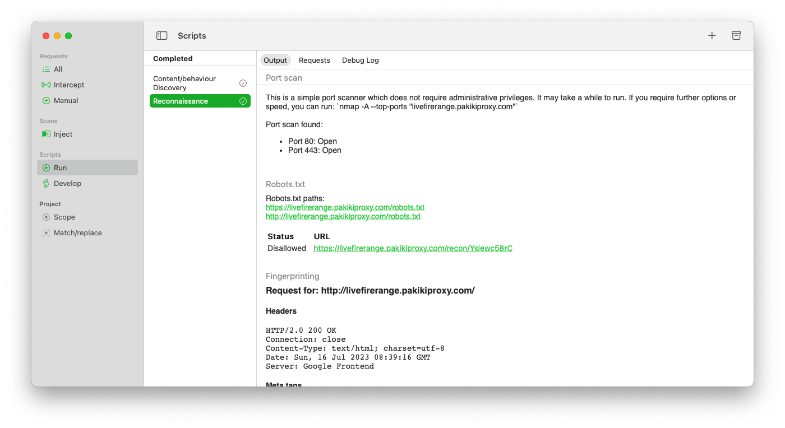
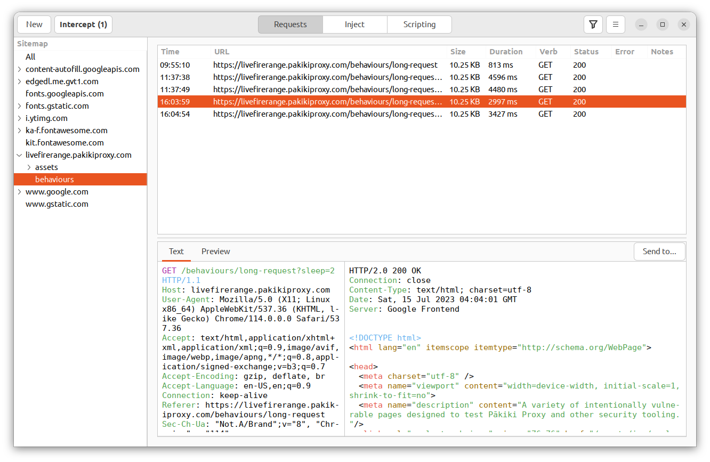
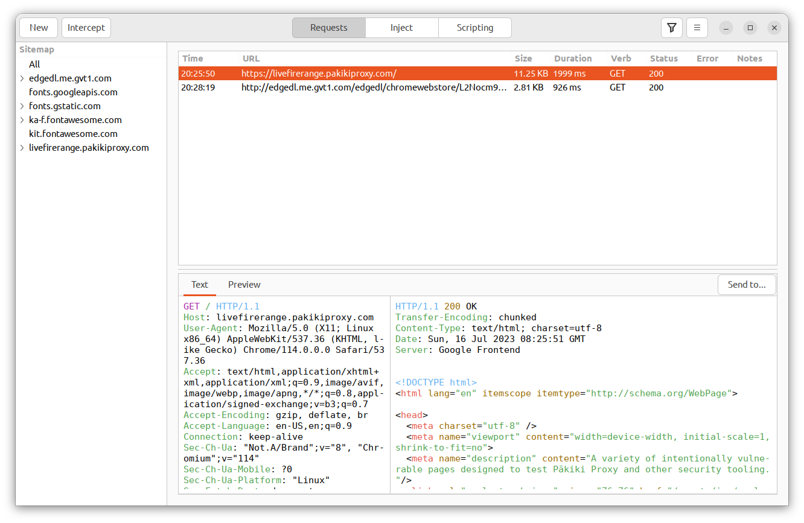
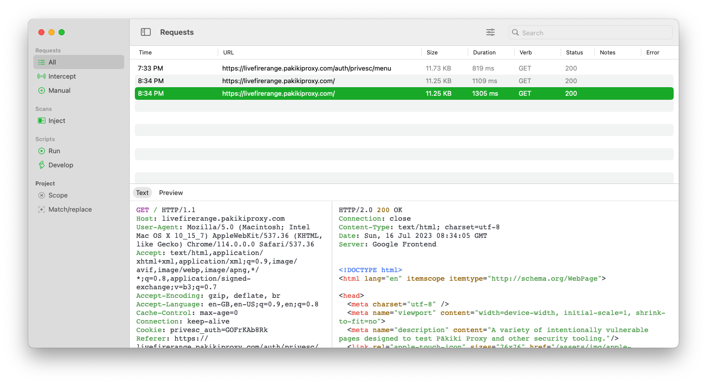
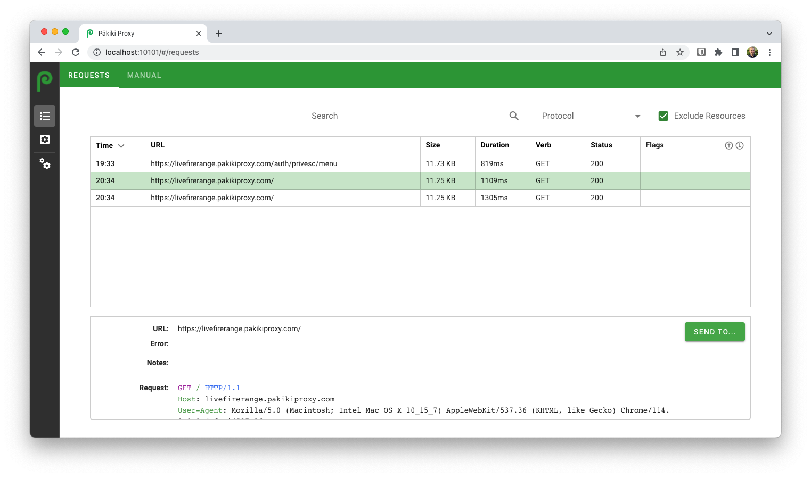
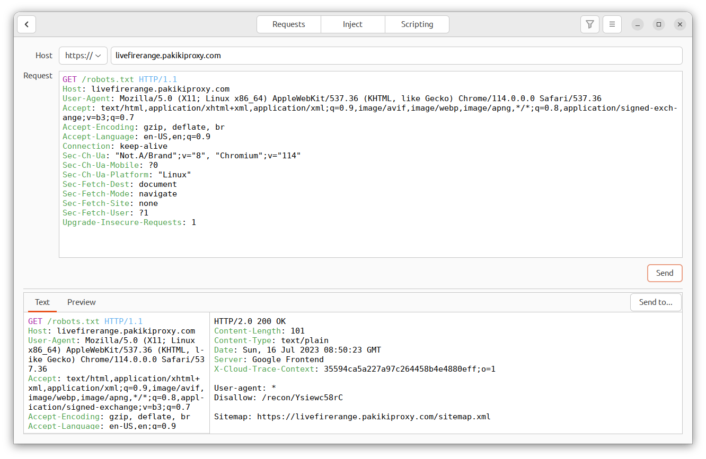
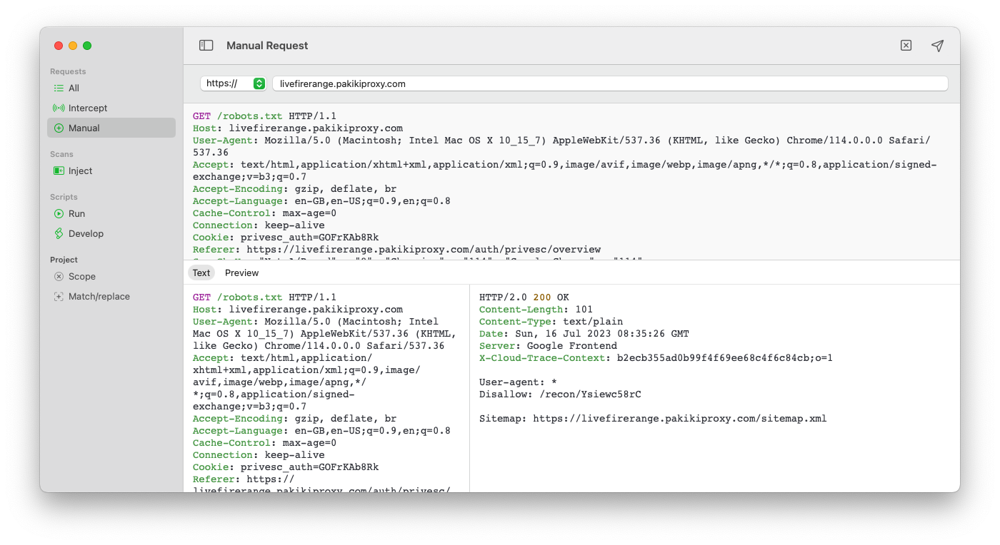
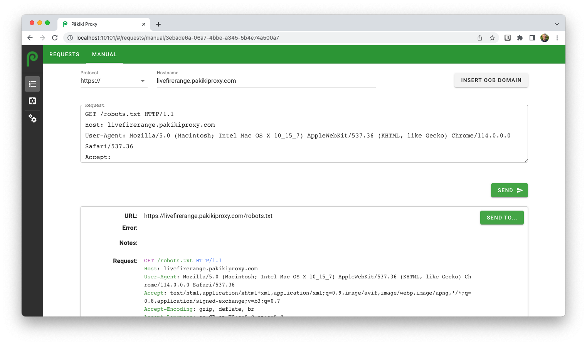

# Profiling

One of the first tasks when carrying out a penetration test is to understand the site, what features/functionality it has, and understand the technologies in use so you can target attacks.

Irrespective of whether you use the automated reconnaissance features or a manual approach, it's still important to manually explore the site via the proxy and view the requests/responses to understand how it behaves.

## Automated Recon (Pro-only)

To automatically carry out reconnaissance against a site, browse to the site's home page, right click on a request, and then click Send to > Reconnaissance > All. If necessary, customise which specific discovery tasks are carried out, then click run.

Wait for the script to finish running, then view the report.

By default, this will run scripts which:
 * Carry out a basic port scan (of the top 100 ports, using a TCP Connect scan)
 * List the files in the robots.txt and associated sitemap
 * Return the meta tags, comments across the site, and headers - to help identify the technology stack.
 * Provide links to common search engines to identify other sites on the same server/IP, hidden functionality, etc.
 * Make requests to the server with a variety of HTTP methods and identify which the server responds to.
 * Runs a whois and reverse DNS against the target, to help to ensure that you have positively identify who owns the target domains and infrastructure.
 * Spiders all pages on the site, to help profile the pages which exist, and also lists the comments, meta tags and pages which have forms. This will also take into account the robots.txt file, and will use the most recent cookies sent to the site.

<!-- tabs:start -->

#### **Linux**

<picture>
  <source media="(prefers-color-scheme: dark)" srcset="../_media/Linux/Dark/Recon.png">
  
</picture>

#### **MacOS**

<picture>
  <source media="(prefers-color-scheme: dark)" srcset="../_media/Mac/Dark/Recon.png">
  
</picture>

<!-- tabs:end -->

## Manual

### Infrastructure

While there are no features in the community version of Pākiki to help with infrastructure testing, it is recommended that `whois` is run against the target domain and the server's IP address to ensure that this information lines up with your expectations. A reverse dns lookup should also be performed on the IP address to ensure this lines up with your expectations using `nslookup [ip]`. For example, if you were testing an Australian website, and the target IP address range was owned by a South American hosting provider, or the whois information indicated that the domain name wasn't owned by the target organisation, then this should be questioned. **Do not be wreckless as to whether you have authorisation to test a site or system. Depending on your jurisdiction the penalties can be serious.**

An `nmap` scan should be run to identify what open ports and services are running on the server.

### Site Layout

Explore the site as an average user, taking note of any bespoke or interesting functionality. While any user input has the potential to have vulnerabilities present, file upload functionality, search fields and reporting systems are often of particular interest. After you've browsed the site, enable the sitemap functionality (if it's not already enabled) to get a sense of the site's request structure and how it works. This will help you to understand the potential frameworks in use, and give you a starting point for finding hidden functionality.

 <!-- tabs:start -->

#### **Linux**

On Linux this can be enabled by dragging the sitemap open from the very left of the requests tab:

<picture>
  <source media="(prefers-color-scheme: dark)" srcset="../_media/Linux/Dark/Sitemap.png">
  
</picture>

#### **MacOS**

On MacOS the sitemap can be toggled via the "View" menu in the top menu bar:

<picture>
  <source media="(prefers-color-scheme: dark)" srcset="../_media/Mac/Dark/Sitemap.png">
  
</picture>

#### **Web**

The sitemap isn't available in the web interface.

<!-- tabs:end -->

### Fingerprinting
To help identify what framework and technologies an application is running on, you can often use the headers, meta tags, cookies and comments in the code. If one of these looks to be placed there by an infrastructure component, and you're not familiar with it, you can often Google for it and find out what it's set by.  You can then use this information to send payloads specific to the application's stack, and to search for CVEs and other vulnerabilities relating to the underlying infrastructure.

You can view the headers, meta tags, comments and cookies by selecting a request and viewing the request/response:

 <!-- tabs:start -->

#### **Linux**

<picture>
  <source media="(prefers-color-scheme: dark)" srcset="../_media/Linux/Dark/Request.png">
  
</picture>

#### **MacOS**

<picture>
  <source media="(prefers-color-scheme: dark)" srcset="../_media/Mac/Dark/Request.png">
  
</picture>

#### **Web**

<picture>
  <source media="(prefers-color-scheme: dark)" srcset="../_media/Web/Dark/Request.png">
  
</picture>

<!-- tabs:end -->

### robots.txt
The robots.txt is designed to give search engines instructions on what they can index on a site. On many sites, this file will also contain the directories which the developers explicitly don't want to be found via Google which can give us a useful starting point for areas of the application which we want to explore. In some cases, the robots.txt file will also contain a reference to a sitemap file which contains a list of all pages on the site.

To view fetch the robots.txt file, either right click on a request, or once a request is selected, click the "Send To" button in the top-right of the request/response pane. Then click "New request".

This will then show you a window where you can craft a new request. Replace the top line of this with: `GET /robots.txt HTTP/1.1` and leave the rest of the request in-tact. Then click "Send".

 <!-- tabs:start -->

#### **Linux**

<picture>
  <source media="(prefers-color-scheme: dark)" srcset="../_media/Linux/Dark/Robots.png">
  
</picture>

#### **MacOS**

<picture>
  <source media="(prefers-color-scheme: dark)" srcset="../_media/Mac/Dark/Robots.png">
  
</picture>

#### **Web**

<picture>
  <source media="(prefers-color-scheme: dark)" srcset="../_media/Web/Dark/Robots.png">
  
</picture>

<!-- tabs:end -->
